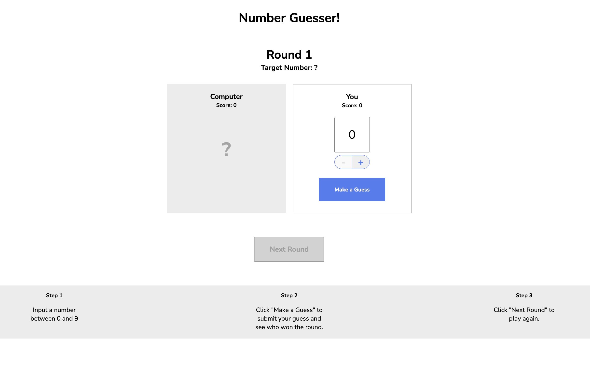

# number_guesser
> A number guessing game in which you have to make a guess of a number between 0 and 9. If your guessed number is closer to the secret target number than the distance between the computer's guessed number and the secret target number, then you win the game! If the latter is closer, then the computer wins! Good Luck!

---

## Link to play the game here

[number_guesser](https://eunjistewart.github.io/number_guesser/)

---

## Screen Shots (images)

---

## Technologies Used

- JavaScript
- HTML
- CSS

---

## Getting Started

1.  Go to the game [link](https://eunjistewart.github.io/number_guesser/)
2.  Start playing the game by selecting a number that you are trying to guess
3.  There are two ways to enter your number. You can use the arrows to select the number between 0 and 9, or just type it in manually.
4.  If your guessed number is closer to the secret target number than the distance between the computer's guessed number and the secret target number, then you win the game! If the latter is closer, then the computer wins! Good Luck!

---

## Next Steps

### (Planned Future Enhancements)

- Re-design the flexbox in css
- Insert Images
 
---

##### Created as a project in the Front-End Engineer Career Paths course at Codecademy By Eunji Lee, 2023
